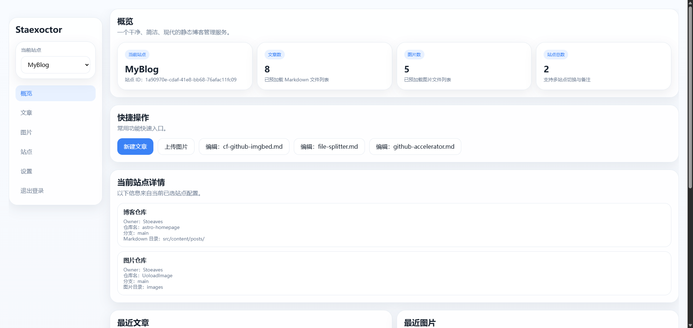
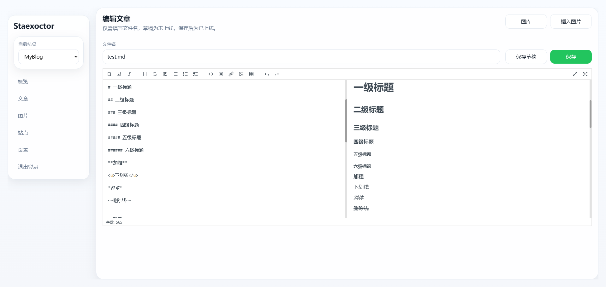

    
    
<em>一个基于 <b>Cloudflare Workers + Cloudflare KV</b> 构建的静态博客管理服务。  
</em>
    

---

## 简介

Staexoctor 是一个基于 **Cloudflare Workers + Cloudflare KV** 构建的静态博客管理服务。  
它面向 GitHub 仓库存储的静态博客内容，提供文章管理、图片管理、多站点切换、Markdown 编辑、草稿管理等能力，可用于管理 Hexo、Hexo 类博客或其他基于 Markdown 与静态资源仓库的博客项目。

## 预览

## 文档

[Staexoctor 文档](https://docs.stoeaves.com/staexoctor/)

## 贡献

欢迎提交 Issue 或 Pull Request，共同完善 Staexoctor。

## 许可证
Staexoctor 使用 [MIT](LICENSE) 许可证。

## Star History

<a href="https://www.star-history.com/?repos=Stoeaves%2FStaexoctor&type=date&legend=top-left">
 <picture>
   <source media="(prefers-color-scheme: dark)" srcset="https://api.star-history.com/chart?repos=Stoeaves/Staexoctor&type=date&theme=dark&legend=top-left" />
   <source media="(prefers-color-scheme: light)" srcset="https://api.star-history.com/chart?repos=Stoeaves/Staexoctor&type=date&legend=top-left" />
   
 </picture>
</a>